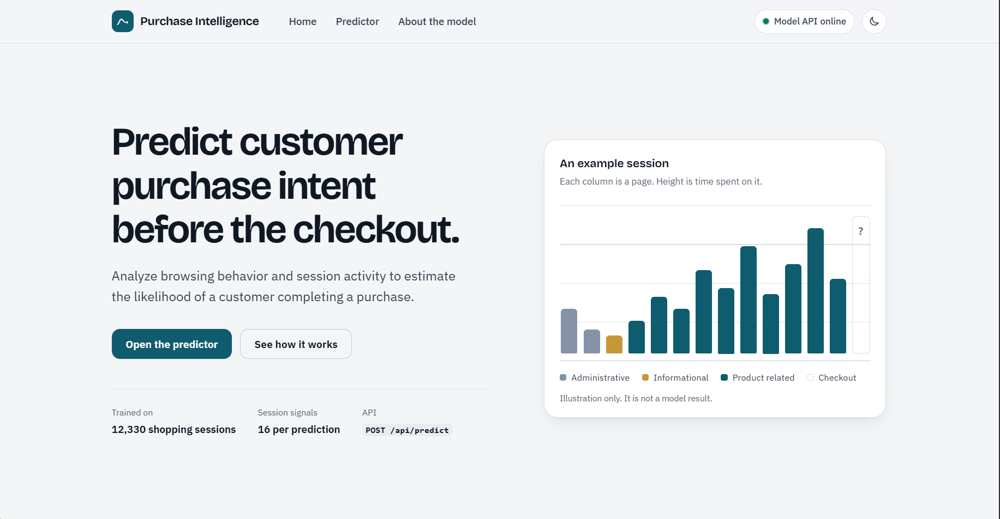
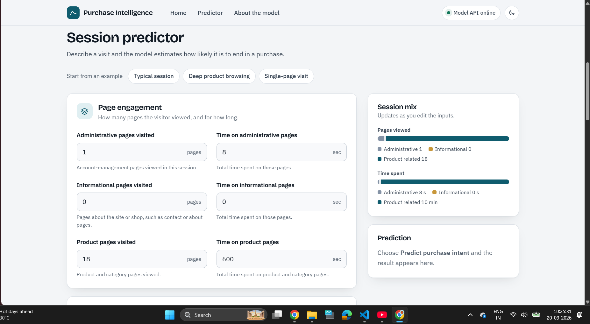
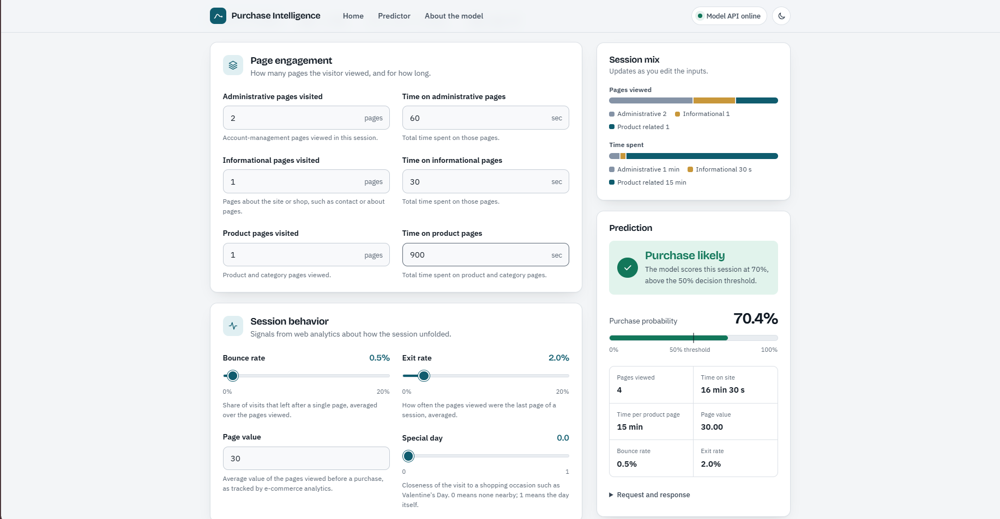
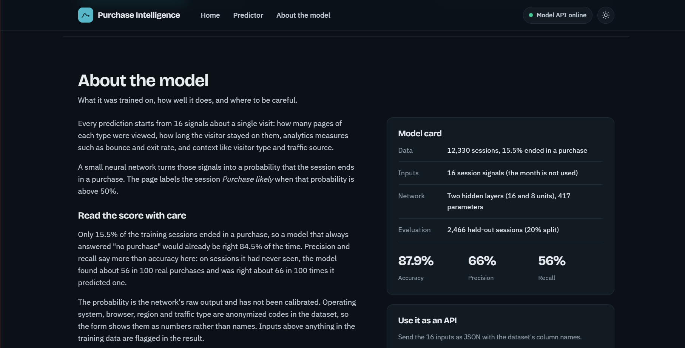
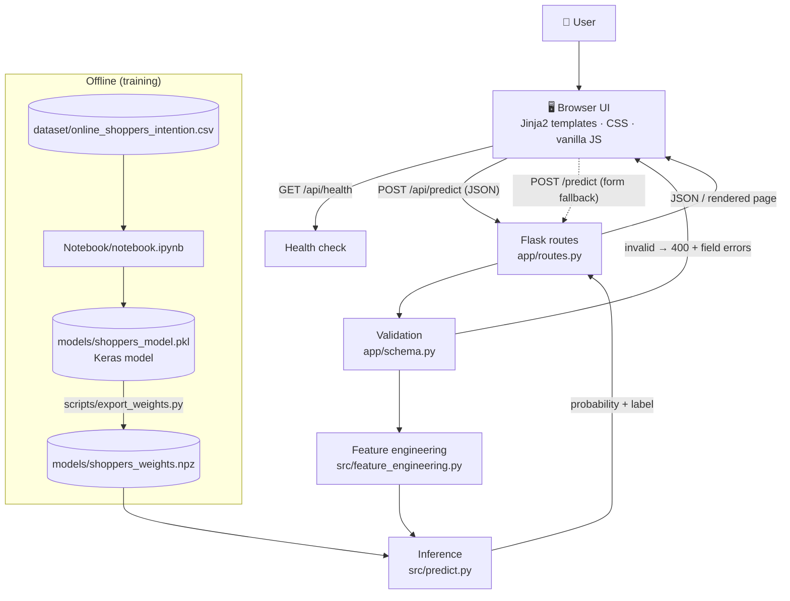

<div align="center">

# 🛒 Purchase Intelligence

### Shoppers Purchasing Intention Predictor

**Estimate whether a website visit will end in a purchase, from session behavior alone.**

[](https://purchase-intelligence.onrender.com/)


[Live Demo](https://purchase-intelligence.onrender.com/) · [Repository](https://github.com/ajya97/Purchase-Intelligence) · [API](#-api-documentation) · [Model](#-model-performance)

</div>

---

## 📖 Overview

**Purchase Intelligence** is a Flask web application that estimates the likelihood that an e-commerce session ends in a purchase. You describe a visit using 16 behavioral and contextual signals (pages viewed, time on page, bounce and exit rates, page value, visitor type, and so on). A small neural network trained on the *Online Shoppers Purchasing Intention* dataset returns a purchase probability and a **Purchase likely / Purchase unlikely** label.

The project covers the full path from notebook to deployed product:

- a training notebook that produces a Keras model,
- a NumPy inference layer, so production needs no TensorFlow,
- a validated JSON API,
- a responsive, accessible dashboard-style interface (HTML, CSS and vanilla JavaScript),
- deployment on Render.

---

## ✨ Features

| Feature | Description |
|---|---|
| 🎯 **Purchase prediction** | Returns a boolean prediction, a label and the model's raw probability. Sessions above a 50% probability are labelled *Purchase likely*. |
| 🧾 **Grouped predictor form** | 16 inputs split into *Page engagement*, *Session behavior* and *Visitor context*, with sliders, number fields, dropdowns and a weekend switch. |
| 🧪 **Example sessions** | One-click presets (*Typical session*, *Deep product browsing*, *Single-page visit*) to try the model quickly. |
| 📊 **Live session mix** | Two stacked bars show how pages and time split across administrative, informational and product pages as you edit the inputs. |
| ✅ **Validation** | Inline field errors and toast notifications in the browser, plus server-side validation of every input on both prediction routes. |
| ⚠️ **Out-of-range warnings** | Values above anything in the training data are flagged in the result so the score can be read with care. |
| 🔎 **Transparent results** | The result card shows the probability against the 50% threshold, session metrics, and the raw request and response JSON with a copy button. |
| 🟢 **API status indicator** | The header pill calls `GET /api/health` and shows whether the model API is online or offline. |
| 🌗 **Light and dark themes** | Theme toggle with the choice saved in `localStorage`. |
| 📱 **Responsive and accessible** | Mobile-first layout, keyboard-friendly controls, labelled inputs, ARIA roles for the meter and status messages, and reduced-motion support. |
| 🛟 **No-JavaScript fallback** | `POST /predict` renders a server-side result page, so the form still works without JavaScript. |
| 🔌 **JSON API** | `POST /api/predict` accepts the dataset's own column names and returns a structured response. |

---

## 🖥️ Live Demo

| | |
|---|---|
| 🚀 **Live application** | **[purchase-intelligence.onrender.com](https://purchase-intelligence.onrender.com/)** |
| 💻 **Source code** | **[github.com/ajya97/Purchase-Intelligence](https://github.com/ajya97/Purchase-Intelligence)** |

---

## 📸 Screenshots

> Screenshots are not yet committed to the repository. To add them, save the images under `docs/screenshots/` using the file names below and they will render here.

| Home / Hero | Predictor form |
|:---:|:---:|
|  |  |
| *Landing view with an illustrative example session* | *Grouped inputs with the live session mix* |

| Prediction result | About the model (dark theme) |
|:---:|:---:|
|  |  |
| *Verdict, probability meter and session metrics* | *Model card and API example* |

---

## 🧠 How It Works

```text
Session description (16 inputs)
        ↓
Browser: inline validation + JSON request
        ↓
Flask: POST /api/predict
        ↓
Schema validation (types, ranges, allowed values)
        ↓
Feature engineering (training column order, VisitorType and Weekend encoding)
        ↓
NumPy forward pass: 16 → 16 → 8 → 1 (ReLU, ReLU, sigmoid)
        ↓
Probability > 0.5 ?  →  Purchase likely / Purchase unlikely
        ↓
JSON response → result card (probability, metrics, warnings)
```

---

## 🏗️ System Architecture



---

## 🛠️ Tech Stack

| Category | Technology |
|---|---|
| **Frontend** | HTML5, CSS3, vanilla JavaScript, Jinja2 templates, Google Fonts (Bricolage Grotesque, IBM Plex Sans) |
| **Backend** | Python 3.11, Flask 3.1.3, Gunicorn 23.0.0 |
| **Inference** | NumPy 2.2.6 (weights exported from the Keras model) |
| **Model training** | Keras / TensorFlow (Sequential dense network), scikit-learn (`LabelEncoder`, `train_test_split`, metrics), pandas, NumPy |
| **Analysis** | Jupyter Notebook, matplotlib, seaborn |
| **Dataset** | UCI Online Shoppers Purchasing Intention (Sakar et al., 2019) |
| **Deployment** | Render (Web Service) |
| **Database** | None |

> Production installs only Flask, Gunicorn and NumPy. TensorFlow is needed only to retrain or to re-export the weights.

---

## 📂 Project Structure

```text
Purchase-Intelligence/
│
├── app/
│   ├── __init__.py            # App factory, error handlers, security headers
│   ├── routes.py              # Pages, form fallback, JSON API, health check
│   └── schema.py              # The 16 input fields: labels, ranges, validation, presets, model facts
│
├── src/
│   ├── feature_engineering.py # Training column order + VisitorType/Weekend encoding
│   └── predict.py             # NumPy forward pass, returns prediction + probability
│
├── models/
│   ├── shoppers_model.pkl     # Trained Keras model (as produced by the notebook)
│   └── shoppers_weights.npz   # Exported weights used in production
│
├── scripts/
│   ├── export_weights.py      # Keras model → .npz, with a parity check
│   └── evaluate_model.py      # Reproduces the held-out metrics
│
├── Notebook/
│   └── notebook.ipynb         # Exploration, preprocessing and model training
│
├── dataset/
│   └── online_shoppers_intention.csv
│
├── templates/                 # base.html, index.html, predict.html
├── static/
│   ├── css/style.css
│   ├── js/script.js
│   └── images/favicon.svg
│
├── run.py                     # Entry point (app = create_app())
├── requirements.txt
├── .python-version            # Python version used by Render
├── runtime.txt                # Heroku-style version file (not read by Render)
├── Procfile                   # Heroku-style process file (not used by Render)
└── README.md
```

| Path | Purpose |
|---|---|
| `app/schema.py` | Single source of truth for the inputs. It drives form rendering, server-side validation and out-of-range warnings, so the three can't drift apart. |
| `src/predict.py` | Loads the weights once (thread-safe) and evaluates the network with NumPy. |
| `scripts/export_weights.py` | Converts the Keras model to `.npz` and checks it against Keras on the full dataset. |

---

## 📥 Model Inputs

The model uses 16 features. Column names below are the exact names the API expects.

| Group | Field (API name) | Form label | Type / range |
|---|---|---|---|
| Page engagement | `Administrative` | Administrative pages visited | integer, 0 to 5000 |
| | `Administrative_Duration` | Time on administrative pages | seconds, 0 to 200000 |
| | `Informational` | Informational pages visited | integer, 0 to 5000 |
| | `Informational_Duration` | Time on informational pages | seconds, 0 to 200000 |
| | `ProductRelated` | Product pages visited | integer, 0 to 5000 |
| | `ProductRelated_Duration` | Time on product pages | seconds, 0 to 200000 |
| Session behavior | `BounceRates` | Bounce rate | fraction, 0 to 1 (UI slider shows 0 to 20%) |
| | `ExitRates` | Exit rate | fraction, 0 to 1 (UI slider shows 0 to 20%) |
| | `PageValues` | Page value | number, 0 to 10000 |
| | `SpecialDay` | Special day | 0 to 1 (dataset uses steps of 0.2) |
| Visitor context | `OperatingSystems` | Operating system | code 1 to 8 |
| | `Browser` | Browser | code 1 to 13 |
| | `Region` | Region | code 1 to 9 |
| | `TrafficType` | Traffic type | code 1 to 20 |
| | `VisitorType` | Visitor type | `New_Visitor`, `Returning_Visitor`, `Other` |
| | `Weekend` | Weekend visit | boolean |

> Operating system, browser, region and traffic type are anonymized integer codes in the dataset, so the interface shows them as numbers rather than names.

---

## ⚙️ Installation

```bash
git clone https://github.com/ajya97/Purchase-Intelligence.git
cd Purchase-Intelligence

python -m venv venv
```

**Windows**

```powershell
venv\Scripts\activate
```

**Linux / macOS**

```bash
source venv/bin/activate
```

Then install the dependencies:

```bash
pip install -r requirements.txt
```

`requirements.txt` pins `Flask==3.1.3`, `gunicorn==23.0.0` and `numpy==2.2.6`. The project targets **Python 3.11** (see `.python-version`).

---

## 🔐 Environment Variables

No environment variables are required.

| Variable | Required | Purpose |
|---|---|---|
| `PORT` | No | Port used by `python run.py` (defaults to `10000`). Render sets this automatically in production. |
| `FLASK_DEBUG` | No | Set to `1` to enable Flask debug mode when running `run.py` locally. |

The project contains no API keys or secrets.

---

## ▶️ Running Locally

```bash
python run.py
```

Open **http://127.0.0.1:10000**.

To run it the way production does:

```bash
gunicorn run:app --bind 0.0.0.0:10000 --workers 2 --timeout 60
```

---

## 🔌 API Documentation

| Method | Endpoint | Purpose |
|---|---|---|
| `GET` | `/` | Landing page and predictor |
| `POST` | `/predict` | Server-rendered form fallback (used without JavaScript) |
| `POST` | `/api/predict` | JSON prediction API |
| `GET` | `/api/health` | Reports whether the model is loaded |

### `POST /api/predict`

**Request**

```json
{
  "Administrative": 1,
  "Administrative_Duration": 8,
  "Informational": 0,
  "Informational_Duration": 0,
  "ProductRelated": 18,
  "ProductRelated_Duration": 600,
  "BounceRates": 0.006,
  "ExitRates": 0.03,
  "PageValues": 0,
  "SpecialDay": 0,
  "OperatingSystems": 2,
  "Browser": 2,
  "Region": 1,
  "TrafficType": 2,
  "VisitorType": "Returning_Visitor",
  "Weekend": false
}
```

**Response** `200 OK`

```json
{
  "success": true,
  "prediction": false,
  "label": "Purchase unlikely",
  "probability": 0.0401,
  "threshold": 0.5,
  "warnings": []
}
```

| Field | Meaning |
|---|---|
| `prediction` | `true` when the probability is above `threshold` |
| `label` | `Purchase likely` or `Purchase unlikely` |
| `probability` | Raw sigmoid output of the network (not calibrated) |
| `threshold` | Decision threshold (`0.5`) |
| `warnings` | Notes for inputs above the largest value seen in training |

**Validation error** `400 Bad Request`

```json
{
  "success": false,
  "error": "Some values are missing or invalid.",
  "errors": {
    "Administrative": "Must be at least 0.",
    "Region": "Select an option."
  }
}
```

Other statuses: `400` for a non-JSON or empty body, `503` if the model weights are unavailable, `500` for an unexpected prediction failure.

**Example call**

```bash
curl -X POST https://purchase-intelligence.onrender.com/api/predict \
  -H "Content-Type: application/json" \
  -d '{"Administrative":1,"Administrative_Duration":8,"Informational":0,"Informational_Duration":0,"ProductRelated":18,"ProductRelated_Duration":600,"BounceRates":0.006,"ExitRates":0.03,"PageValues":0,"SpecialDay":0,"OperatingSystems":2,"Browser":2,"Region":1,"TrafficType":2,"VisitorType":"Returning_Visitor","Weekend":false}'
```

### `GET /api/health`

```json
{
  "status": "healthy",
  "model_loaded": true,
  "service": "Shoppers Purchasing Intention Predictor"
}
```

Returns `200` when the model loads and `503` with `"status": "degraded"` when it does not. The interface uses this endpoint for its status indicator.

---

## 🤖 Machine Learning Pipeline

```text
online_shoppers_intention.csv (12,330 sessions)
        ↓
Drop the "Month" column
        ↓
Split features / target ("Revenue")
        ↓
Train / test split (80% / 20%, random_state=42)
        ↓
Label-encode VisitorType, Weekend and the target
        ↓
Train a Keras Sequential network (no feature scaling)
        ↓
Evaluate on the held-out 20%
        ↓
Serialize with joblib → models/shoppers_model.pkl
        ↓
Export weights → models/shoppers_weights.npz
        ↓
NumPy inference in the web app
```

| Step | Implementation |
|---|---|
| **Dataset** | UCI Online Shoppers Purchasing Intention: 12,330 sessions, 15.5% ended in a purchase |
| **Preprocessing** | `Month` dropped; `VisitorType` label-encoded (`New_Visitor`=0, `Other`=1, `Returning_Visitor`=2); `Weekend` and target encoded as 0/1; no scaling |
| **Architecture** | Dense(16, ReLU) → Dense(8, ReLU) → Dense(1, sigmoid), 417 parameters |
| **Training** | Adam optimizer, binary cross-entropy, 50 epochs, batch size 32, `validation_split=0.2` |
| **Serialization** | Keras model saved with `joblib`; weights exported to `.npz` |
| **Serving** | Forward pass in NumPy; the export matches Keras on all 12,330 rows with zero label differences |

The serving-side encoding in `src/feature_engineering.py` mirrors the notebook exactly, including the feature order.

---

## 📊 Model Performance

Metrics on the **2,466 held-out sessions** (20% split, `random_state=42`, threshold 0.5), reproducible with `python scripts/evaluate_model.py`:

| Metric | Value |
|---|---|
| Accuracy | **87.9%** |
| Precision | 66.0% |
| Recall | 56.2% |
| F1 score | 0.607 |
| ROC AUC | 0.849 |
| Majority-class baseline accuracy | 84.5% |

> ⚠️ **Read these with care.** Only 15.5% of sessions are purchases, so "always predict no purchase" already scores 84.5% accuracy. Recall of 56% means the model misses roughly 44% of real purchases on unseen data. The probability is the network's raw output and has not been calibrated.

---

## 🧪 Testing

The repository does not currently include an automated test suite. Verification is manual:

**Reproduce the reported metrics**

```bash
pip install pandas scikit-learn
python scripts/evaluate_model.py
```

**Check the API locally** (with `python run.py` running)

```bash
curl http://127.0.0.1:10000/api/health
```

**Try the validation** by sending a request with a missing field or a negative count to `/api/predict`. The response should be `400` with a per-field `errors` object.

**Verify the weight export** (requires TensorFlow)

```bash
python scripts/export_weights.py
```

This prints the maximum probability difference between Keras and NumPy and the number of label mismatches.

---

## 🚀 Deployment

The app is deployed as a **Render Web Service**: **[purchase-intelligence.onrender.com](https://purchase-intelligence.onrender.com/)**

| Setting | Value |
|---|---|
| **Build command** | `pip install -r requirements.txt` |
| **Start command** | `gunicorn run:app --bind 0.0.0.0:$PORT --workers 2 --timeout 60` |
| **Python version** | `3.11.9`, from `.python-version` (Render does not read `runtime.txt`) |
| **Health check path** | `/api/health` |
| **Environment variables** | None required |

Because inference runs in NumPy, the deployed service does not install TensorFlow. `runtime.txt` and `Procfile` are included for Heroku-style hosts and are not used by Render.

---

## 🔮 Future Improvements

*These are ideas, not existing features.*

- [ ] Add automated tests (`pytest`) for validation, feature encoding and the API routes
- [ ] Improve recall on the minority (purchase) class, for example with class weighting, threshold tuning and comparison against tree-based baselines
- [ ] Calibrate the probability output
- [ ] Add a confusion matrix and ROC curve to the documentation
- [ ] Set up CI (GitHub Actions) to run tests and the evaluation script
- [ ] Add a Dockerfile
- [ ] Add rate limiting to the public API
- [ ] Tidy the notebook (it contains a stray broken cell) and commit a reproducible training script
- [ ] Add batch prediction (CSV upload)

---

## 🤝 Contributing

Contributions, issues and suggestions are welcome.

1. Fork the repository
2. Create a feature branch: `git checkout -b feature/your-feature`
3. Make your changes and verify them locally (`python run.py`, `python scripts/evaluate_model.py`)
4. Commit with a clear message: `git commit -m "Add your feature"`
5. Push the branch: `git push origin feature/your-feature`
6. Open a Pull Request describing what changed and why

If you change model inputs, keep `app/schema.py` and `src/feature_engineering.py` in the same feature order as training.

---

## 📄 License

No license has currently been specified for this project.

---

## 👨‍💻 Author

**ajya97**

[](https://github.com/ajya97)

---

## 🙏 Acknowledgements

Dataset: *Online Shoppers Purchasing Intention Dataset*, Sakar, C.O., Polat, S.O., Katircioglu, M. et al., *Neural Computing and Applications* 31, 6893–6908 (2019), from the UCI Machine Learning Repository.

---

## ⭐ Support

If you find this project useful, please consider giving it a ⭐ on [GitHub](https://github.com/ajya97/Purchase-Intelligence) or forking it for your own experiments.

<div align="center">

**[🚀 Try the live demo](https://purchase-intelligence.onrender.com/)**

</div>